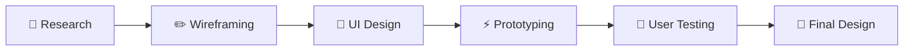

<div align="center">


<br><br>


<br><br>

<p align="center">


</p>

</div>

---

# 🍔 DelishDrops — UI/UX Design Project

## 🎨 About The Project

**DelishDrops** is a modern food delivery mobile application UI/UX design created using **Figma**.  
The project focuses on creating a visually appealing, user-friendly, and interactive food ordering experience with smooth navigation and clean design principles.

The design emphasizes:

- 🍕 Attractive food browsing experience
- 📱 Modern mobile-first UI design
- ⚡ Smooth user interaction flow
- 🛒 Easy food ordering process
- 🎯 User-centered experience
- 🌈 Creative visual aesthetics

Figma is commonly used for collaborative UI/UX prototyping, mobile app wireframing, and interactive design systems. ([figma.com](https://www.figma.com/?utm_source=chatgpt.com))

---

# ✨ Design Highlights

<div align="center">

| 🚀 Feature | 📌 Description |
|---|---|
| 🎨 Modern UI | Clean and attractive mobile screens |
| 📱 Responsive Layout | Mobile optimized design |
| 🛒 Food Ordering Flow | Smooth ordering process |
| 🍔 Product Showcase | Interactive food display cards |
| 🔍 Smart Navigation | Easy user interaction |
| ❤️ User Experience Focus | Minimal and intuitive design |
| 🌈 Creative Color Palette | Engaging visual aesthetics |
| ⚡ Interactive Prototype | Seamless screen transitions |

</div>

---

# 📲 Application Screens

<div align="center">

| 📱 Screen | 🎯 Purpose |
|---|---|
| 🏠 Home Screen | Food recommendations & categories |
| 🍕 Product Page | Food details and pricing |
| 🛒 Cart Screen | Order summary & checkout |
| ❤️ Favorites | Saved food items |
| 👤 Profile Screen | User account management |
| 🔔 Notification Screen | Order updates and alerts |

</div>

---

# 🎯 UI/UX Objectives

## ✅ Main Goals

- Build an attractive food delivery interface
- Improve user engagement and accessibility
- Create smooth navigation flow
- Enhance ordering experience
- Deliver modern mobile UI aesthetics

UI/UX case studies for food delivery apps often focus on usability, accessibility, visual hierarchy, and streamlined ordering workflows. ([uxdesign.cc](https://uxdesign.cc/?utm_source=chatgpt.com))

---

# 🛠️ Tools & Technologies

<div align="center">

<table>

<tr>

<td align="center" width="200">
<br>
<b>Figma</b>
</td>

<td align="center" width="200">
<br>
<b>Photoshop</b>
</td>

<td align="center" width="200">
<br>
<b>Illustrator</b>
</td>

<td align="center" width="200">
<br>
<b>GitHub</b>
</td>

</tr>

</table>

</div>

---

# 🌈 Design System

## 🎨 Color Palette

<div align="center">

| Color | Usage |
|---|---|
| 🟥 Coral Red | Primary CTA Buttons |
| 🟧 Orange Gradient | Highlights & Cards |
| ⚪ White | Background & Layout |
| ⚫ Dark Gray | Text & Icons |

</div>

---

# 📸 Project Preview

<div align="center">


</div>

---

# 🧩 UI/UX Workflow



---

# 📂 Project Structure

```bash
📦 DelishDrops-UIUX
 ┣ 📂 Screens
 ┣ 📂 Components
 ┣ 📂 Assets
 ┣ 📂 Prototypes
 ┣ 📂 Wireframes
 ┣ 📜 README.md
 ┗ 📜 Design-System.fig
```

---

# 🚀 How To View The Design

## 📥 Clone Repository

```bash
git clone https://github.com/Nksnaveenks/UI-UX-Design-DelishDrops-App-Figma.git
```

---

## 📂 Open In Figma

1️⃣ Open Figma  
2️⃣ Import `.fig` design files  
3️⃣ Explore interactive prototype screens 🚀

Figma supports collaborative design systems, prototypes, and interactive mobile UI workflows. ([help.figma.com](https://help.figma.com/hc/en-us?utm_source=chatgpt.com))

---

# 💡 Key UI/UX Concepts Used

<div align="center">

| 📚 Concept | 🚀 Implementation |
|---|---|
| Visual Hierarchy | Better content visibility |
| Consistency | Unified design language |
| Accessibility | User-friendly layouts |
| Responsive Design | Mobile-first approach |
| Minimalism | Clean interface design |

</div>

---

# 🌟 Future Improvements

- 🌙 Dark Mode Design
- 🤖 AI Food Recommendations
- 📍 Live Order Tracking UI
- 🎙️ Voice Search Interface
- 💳 Payment Gateway Screens
- 🌍 Multi-language Support
- 📱 Tablet Responsive Layouts

---

# 🤝 Contribution

Contributions are welcome!

## 📌 Contribution Steps

### 1️⃣ Fork Repository

### 2️⃣ Clone Project

```bash
git clone https://github.com/your-username/UI-UX-Design-DelishDrops-App-Figma.git
```

### 3️⃣ Create New Branch

```bash
git checkout -b feature-name
```

### 4️⃣ Commit Changes

```bash
git commit -m "Updated UI Design"
```

### 5️⃣ Push Changes

```bash
git push origin feature-name
```

### 6️⃣ Open Pull Request 🚀

---

# 🛡️ License

Licensed under the **MIT License**.

---

# 👨‍💻 Designer

<div align="center">


# 🚀 Naveen K S

### UI/UX Designer • Associate Software Engineer @ Accenture

<br>

<a href="https://github.com/Nksnaveenks">

</a>

<a href="https://linkedin.com">

</a>

</div>

---

# ✨ Design Philosophy

> “Great design is invisible — it simply feels right.”

---

<div align="center">


# ⭐ If You Like The Design, Give This Repository A Star ⭐

</div>
